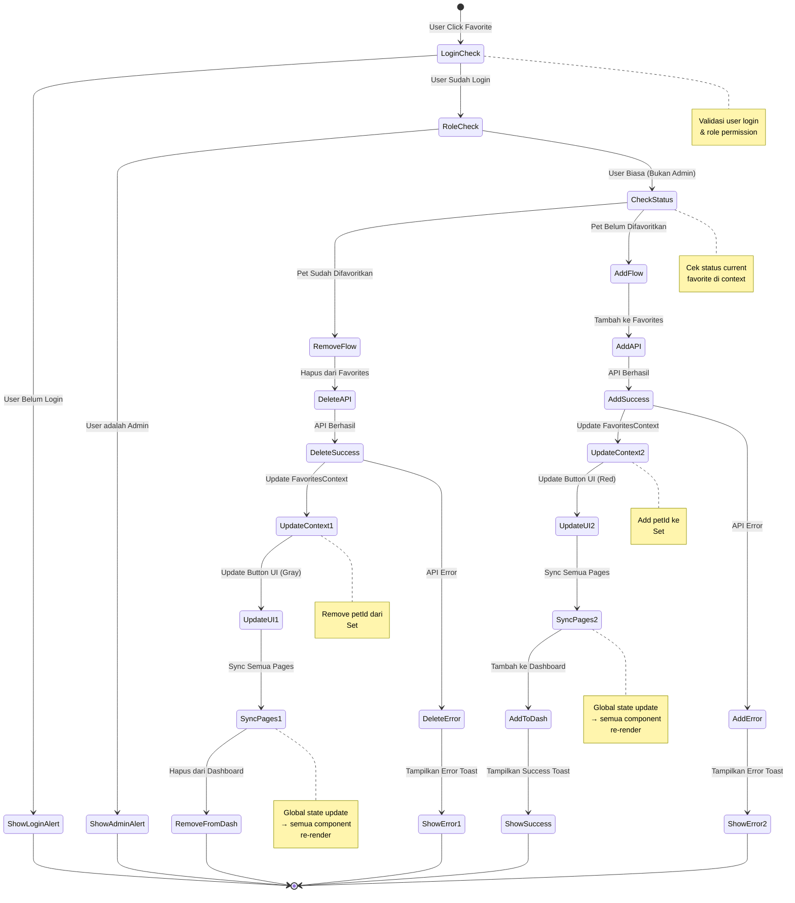
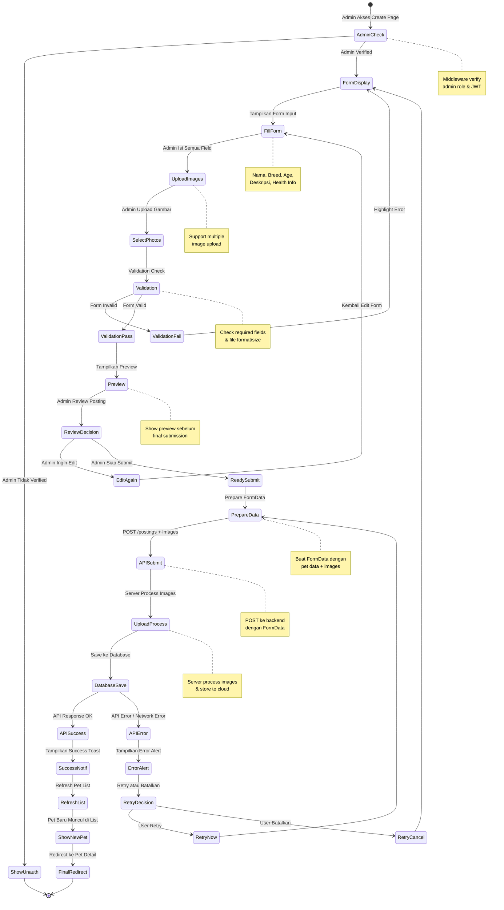
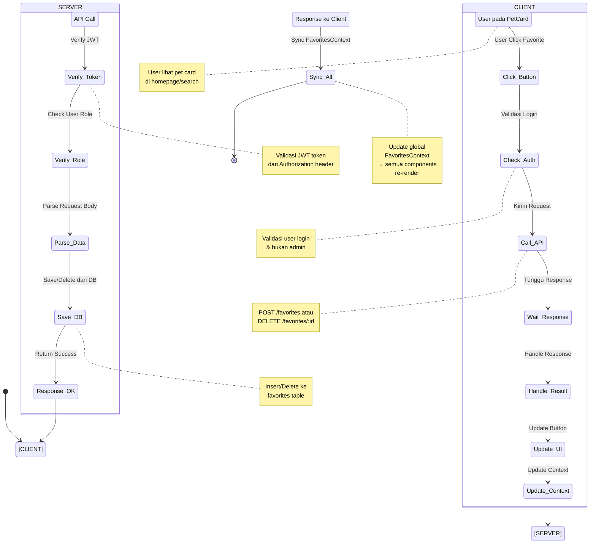
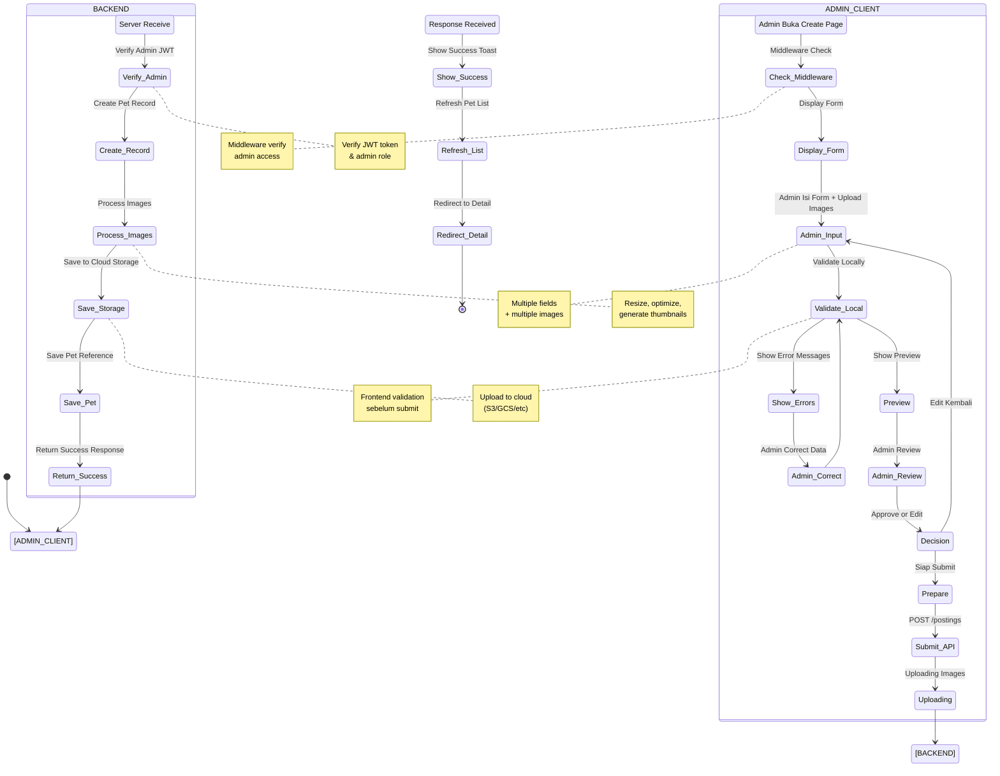
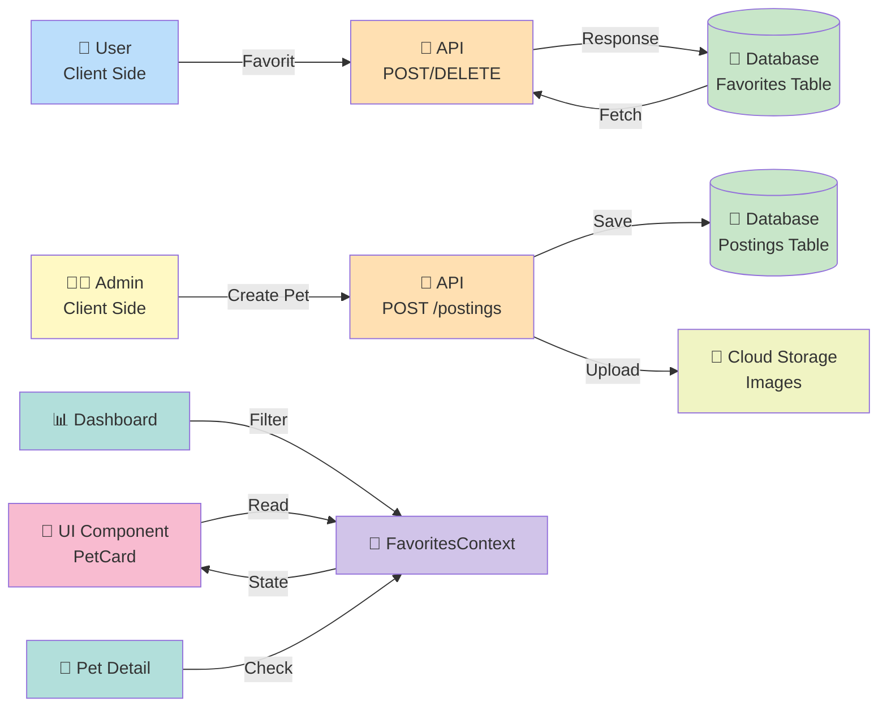
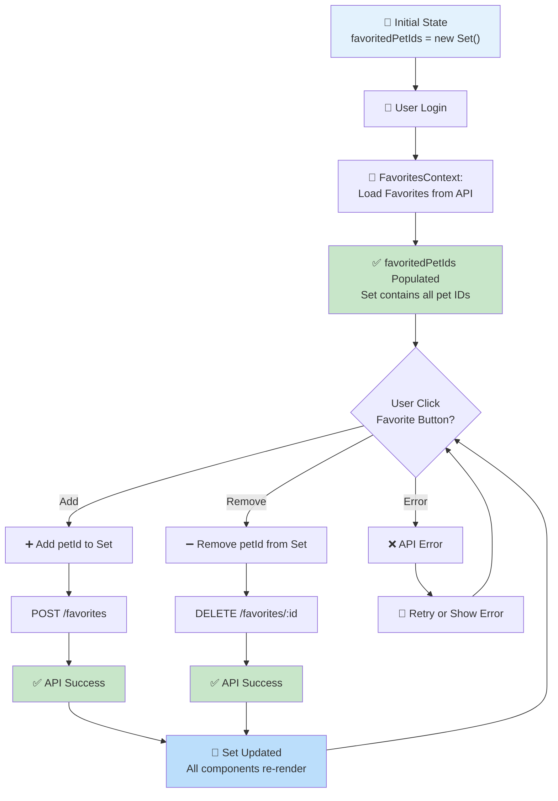

# 📊 Activity Diagrams - Adopt House

Dokumentasi alur aktivitas untuk fitur-fitur utama Adopt House menggunakan Mermaid State Diagram (UML Activity Style).

---

## 1️⃣ State Diagram: User Melakukan Favorit



### 📝 Penjelasan State Flow:

| State | Deskripsi |
|-------|-----------|
| **LoginCheck** | Validasi user sudah login & bukan admin |
| **ShowLoginAlert** | Jika user belum login, tampilkan login required alert |
| **RoleCheck** | Cek apakah user adalah admin |
| **ShowAdminAlert** | Jika admin, tampilkan alert hanya user biasa |
| **CheckStatus** | Lihat apakah pet sudah difavoritkan di context |
| **RemoveFlow** | Alur hapus favorite (DELETE /favorites/:id) |
| **AddFlow** | Alur tambah favorite (POST /favorites) |
| **UpdateContext1/2** | Update global FavoritesContext Set |
| **UpdateUI1/2** | Button berubah warna (red ↔ gray) |
| **SyncPages1/2** | Semua instances pet update otomatis |
| **RemoveFromDash/AddToDash** | Pet hilang/muncul di dashboard |

---

## 2️⃣ State Diagram: Admin Membuat Pet Posting



### 📝 Penjelasan State Flow:

| State | Deskripsi |
|-------|-----------|
| **AdminCheck** | Middleware verifikasi admin role & JWT token |
| **ShowUnauth** | Jika bukan admin, redirect ke home |
| **FormDisplay** | Tampilkan form input posting |
| **FillForm** | Admin isi nama, breed, age, deskripsi, etc |
| **UploadImages** | Admin upload multiple pet photos |
| **SelectPhotos** | Preview & confirm selected images |
| **Validation** | Cek required fields & file format/size |
| **ValidationFail** | Highlight error fields, kembali ke form |
| **ValidationPass** | Semua field valid, lanjut preview |
| **Preview** | Tampilkan preview final posting |
| **ReviewDecision** | Admin review & decide edit atau submit |
| **EditAgain** | Admin ingin edit kembali |
| **ReadySubmit** | Admin siap submit final |
| **PrepareData** | Siapkan FormData dengan file |
| **APISubmit** | POST ke backend `/postings` |
| **UploadProcess** | Server process images & store |
| **DatabaseSave** | Save posting record ke database |
| **APISuccess** | Response OK, posting created |
| **APIError** | Error response atau network error |
| **ErrorAlert** | Show error notification |
| **RetryDecision** | User bisa retry atau batalkan |
| **SuccessNotif** | Show success toast notification |
| **RefreshList** | Refresh pet list di admin panel |
| **ShowNewPet** | Pet baru muncul di list |
| **FinalRedirect** | Redirect ke pet detail page |

---

## 3️⃣ Swimlane Style: User Favorite dengan Client-Server



---

## 4️⃣ Swimlane Style: Admin Create Posting dengan Client-Server



---

## 🔄 Alur Integrasi Sistem



---

## 🎯 State Flow - Favorite Feature



---

## 📊 Perbandingan User vs Admin Flow

| Aspek | User Favorite | Admin Create Posting |
|-------|---------------|---------------------|
| **Authorization** | Cek user login | Cek admin role + middleware |
| **Data Input** | Minimal (just click) | Extensive (form fields) |
| **Validation** | Cek pet ID valid | Form validation + image |
| **API Call** | 1 endpoint | 1 endpoint + image upload |
| **Database** | Update favorites table | Insert postings table |
| **Storage** | N/A | Upload images to storage |
| **UI Update** | Instant (context) | Redirect to detail page |
| **Time Estimate** | < 1 detik | 3-10 detik (include upload) |

---

## 🔐 Security Considerations

### User Favorite Flow
```
✅ JWT Token dalam header
✅ Validate user ownership (backend)
✅ Rate limiting (prevent spam)
✅ Input sanitization
```

### Admin Create Posting Flow
```
✅ JWT Token dalam header
✅ Verify admin role (backend)
✅ Middleware protection (frontend)
✅ File type validation (images only)
✅ File size limits
✅ Virus scanning
✅ Malware detection
```

---

**Last Updated:** 23 Juni 2026  
**Created By:** Adopt House Documentation Team
